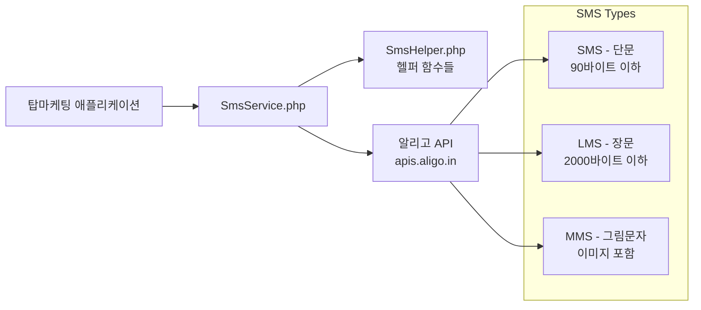

# 탑마케팅 플랫폼 시스템 아키텍처

**최종 수정일:** 2025-10-18 KST
**문서 버전:** v3.89.7

---

## 개요

탑마케팅 플랫폼은 **커뮤니티 중심 서비스**로서, 네트워크 마케팅 리더 및 기업가를 지원하기 위해 사용자 간 정보 교환, 게시판, 댓글, 채팅, 강의/행사 관리 기능을 제공합니다. 전체 시스템은 **LAMP 스택**을 기반으로 구축되었으며, 실시간 기능은 **Firebase**를 통해 구현되었습니다.

**🎯 현재 상태 (v3.89.7 기준, 2025-10-18 KST):**

### 핵심 시스템 (완전 구현 ✅)
- ✅ **MVC 아키텍처**: BaseController 기반 24개 컨트롤러 구조화
- ✅ **RESTful API**: 100+ 엔드포인트 (22개 컨트롤러)
- ✅ **JWT 인증 시스템**: 30일 장기 로그인 + 자동 토큰 갱신
- ✅ **SMS 인증**: 알리고 API 연동 (회원가입, 강의 알림 등)
- ✅ **reCAPTCHA v3**: 봇 방지 시스템

### 커뮤니티 및 콘텐츠 (완전 구현 ✅)
- ✅ **게시판 시스템**: CRUD + 검색 + 페이지네이션 최적화
- ✅ **계층형 댓글**: 대댓글 무제한 depth 지원
- ✅ **좋아요 기능**: 게시글 좋아요 완전 구현
- ✅ **미디어 업로드**: 이미지 30MB + 리사이징 + 캐싱

### 강의/행사 관리 (완전 구현 ✅)
- ✅ **강의 시스템**: 등록, 수정, 삭제, 상세 페이지
- ✅ **행사 시스템**: 등록, 수정, 삭제, 상세 페이지
- ✅ **신청 관리**: 승인/거절/대기자 관리 대시보드
- ✅ **SMS 알림**: 신청 접수/승인/거절 즉시 알림

### 기업 회원 시스템 (완전 구현 ✅)
- ✅ **기업 프로필**: 기업 정보 등록 및 관리
- ✅ **공지사항**: 기업별 공지사항 + 댓글 시스템
- ✅ **권한 관리**: 일반/기업/관리자 3단계 권한

### FCM 푸시 알림 시스템 (완전 구현 ✅, v3.89.0)
- ✅ **9가지 알림 시나리오**: 댓글, 대댓글, 좋아요, 채팅, 신규 강의/행사, 신청 승인/거절, 공지사항
- ✅ **알림 설정 시스템**: 사용자별 5가지 알림 타입 제어 (v3.86.0)
- ✅ **FCM V1 API**: OAuth 2.0 기반 안전한 푸시 전송
- ✅ **대량 발송**: 배치 처리 + 레이트 리밋 방지

### 컴포넌트 시스템 (완전 구현 ✅)
- ✅ **JavaScript 컴포넌트**: 11개 (Toast, Loading, Utils, FormValidator, ApiClient, DateUtils, ClipboardUtils 등)
- ✅ **PHP 컴포넌트**: 5개 (Button, Card, Modal, Pagination, SearchFilter)
- ✅ **중복 제거**: alert() 160개, fetch() 82개 → 컴포넌트로 통합
- ✅ **코드 감소**: 평균 27-85% 중복 코드 제거

### 관리자 시스템 (완전 구현 ✅)
- ✅ **대시보드**: 사용자/게시글/강의/행사 통계
- ✅ **사용자 관리**: 권한 변경, 상태 변경 (활성/비활성)
- ✅ **신청 관리**: 강의/행사 신청 승인/거절 대시보드

### 캐싱 및 성능 (완전 구현 ✅)
- ✅ **Redis 캐시**: 세션, API 응답 캐싱
- ✅ **파일 캐시**: 페이지 캐시 (HTML 조각)
- ✅ **프로필 이미지 최적화**: 캐시 무효화 + 즉시 반영 (v3.89.7)
- ✅ **대용량 페이지네이션**: 10만+ 레코드 최적화

### 로깅 및 보안 (완전 구현 ✅)
- ✅ **WebLogger**: 통합 로깅 시스템 (성공/실패/에러)
- ✅ **CSRF 토큰**: 모든 폼 요청 검증
- ✅ **SQL Injection 방어**: Prepared Statements
- ✅ **XSS 방어**: HtmlSanitizerHelper
- ✅ **AES-256-GCM**: 개인정보 암호화 (v3.18.0)

### 최근 완료 작업 (v3.81.0 ~ v3.89.7)
- ✅ **v3.89.7**: 프로필 이미지 캐시 문제 근본 해결
- ✅ **v3.89.0**: FCM 푸시 알림 9가지 시나리오 + 치명적 버그 3건 수정
- ✅ **v3.86.0**: 알림 설정 시스템 구축
- ✅ **v3.81.0~v3.81.5**: console 로그 1,063개 제거 + 긴급 문법 오류 수정
- ✅ **v3.74.0**: 헤더 로고 위치 완벽 해결

---

## 핵심 기술 스택

### 서버 환경
- **OS:** CentOS Linux release 7.9.2009 (Core)
- **웹 서버:** Apache/2.4.6 (CentOS)
- **서버 사이드:** PHP 8.0.30 (mod_php 또는 PHP-FPM)
- **데이터베이스:** MariaDB 10.6.5 (`TOPMKT` 스키마, UTF8mb4) ⚠️ **대문자 주의!**

### 프론트엔드
- **언어:** HTML5/CSS3/JavaScript (ES6+)
- **JavaScript 컴포넌트:** 11개 (Toast, Loading, Utils, FormValidator, ApiClient, DateUtils, ClipboardUtils, CharacterCounter, UploadConfig, Pagination, Modal)
- **CSS 프레임워크:** 커스텀 CSS (Grid/Flexbox 기반)
- **아이콘:** Font Awesome 6.x
- **폰트:** Google Fonts (Noto Sans KR 등)

### 백엔드
- **MVC 패턴:** BaseController 기반 24개 컨트롤러
- **모델 레이어:** 10개 모델 (User, Post, Comment, Corporate, FcmToken, Notice, NotificationSettings 등)
- **헬퍼 클래스:** 26개 (Auth, Database, File, Session, Mail, Notification, Security, Fcm, Firebase 등)
- **PHP 컴포넌트:** 5개 (Button, Card, Modal, Pagination, SearchFilter)
- **인증:** JWT (JSON Web Token) + HTTP-only Cookie
- **세션 관리:** PHP 세션 + Redis (선택적)

### 실시간 서비스
- **Firebase Realtime Database:** 채팅 메시지 실시간 동기화
- **Firebase Cloud Messaging (FCM):** 푸시 알림 (V1 API, OAuth 2.0)
- **Firebase Admin SDK:** 서버 측 푸시 전송

### 외부 서비스
- **SMS:** 알리고 API (smartsms.aligo.in)
- **보안:** reCAPTCHA v3 (Google)
- **암호화:** AES-256-GCM (개인정보)

### 버전 관리 및 배포
- **Git:** GitHub (feature/refactoring-v4.0.0 브랜치)
- **CI/CD:** GitHub Actions (자동 테스트/배포)
- **문서화:** Markdown (50+ 문서)

---

## 시스템 구성도

```mermaid
flowchart TD
    subgraph Browser
        A[웹 브라우저 (HTML/CSS/JS)]
    end
    subgraph Server
        B[Apache/2.4.6 + PHP 8.0.30 웹 서버<br>(CentOS 7.9)]
        B --> C[MariaDB 10.6.5<br>(topmkt 스키마)]
        B --> D[Firebase (실시간 기능)]
    end
    A -->|HTTPS| B
```

1. **웹 브라우저(클라이언트):**  
   - HTML/CSS로 UI 구성, JavaScript(ES6)로 동적 기능 구현  
   - AJAX 요청으로 서버와 비동기 통신  
   - Firebase SDK 연동: 실시간 채팅, 알림 수신

2. **웹 서버 (Apache + PHP):**  
   - 정적 자산(CSS, JS, 이미지) 제공  
   - PHP 스크립트(mod_php 또는 PHP-FPM)로 동적 요청 처리  
   - **MVC 패턴** 유사 구조:  
     - **Controller (컨트롤러):** 요청 라우팅, 비즈니스 로직 수행  
     - **Model (모델):** MariaDB 쿼리 / ORM / Prepared Statement  
     - **View (뷰):** PHP 템플릿(헤더, 푸터, 개별 페이지)

3. **데이터베이스 (MariaDB):**  
   - 관계형 데이터 저장 (`users`, `company_profiles`, `posts`, `comments`, `tags`, `notifications`, `sessions`, `audit_logs` 등)  
   - InnoDB 스토리지 엔진, 외래 키(FK) 제약, 인덱스 최적화  
   - 정기 백업(`mysqldump`) 및 파티셔닝(월별) 고려  

4. **Firebase (실시간 기능):**  
   - **Realtime Database / Cloud Firestore:**  
     - 채팅 메시지 실시간 동기화  
     - 알림 데이터 저장 및 브라우저 푸시 실시간 업데이트  
   - **Firebase Cloud Messaging (FCM):**  
     - 브라우저/앱 푸시 알림 전송  
   - **Firebase Auth (선택적):**  
     - 현재는 PHP 세션 인증 사용, Firebase Auth 미사용  
     - 향후 모바일 앱 연동 시 검토 가능  

---

## 프론트엔드 (웹 브라우저)
- **HTML 템플릿 / CSS 스타일시트 / JavaScript**  
- **AJAX 호출:** 페이지 새로고침 없이 서버 데이터 요청 및 업데이트  
- **Firebase SDK:**  
  - `import { getDatabase, ref, onValue, push } from "firebase/database";`  
  - 채팅방/알림 컬렉션을 실시간 구독 및 업데이트  
- **라이브러리:**  
  - Vanilla JS, jQuery(필요 시), Vue.js(필요 시)  
  - Axios 또는 Fetch API 사용 가능  
- **반응형 디자인:** 모바일/태블릿 지원 (Media Query 활용)  

---

## 백엔드 (Apache + PHP)

### Apache 웹 서버 (2.4.6)
- **DocumentRoot:** `/var/www/html/topmkt`
- **SSL 설정:** `https://www.topmktx.com` (포트 443)
- **HTTPS 강제:** 모든 HTTP 요청 자동 리다이렉트
- **Gzip 압축:** 활성화 (CSS, JS, HTML)

### PHP 8.0.30
- **실행 모드:** mod_php 또는 PHP-FPM
- **JWT 인증:** 30일 장기 로그인 + 자동 토큰 갱신
- **HTTP-only 쿠키:** 보안 토큰 관리
- **PDO Prepared Statements:** SQL Injection 방어
- **보안 함수:** `htmlspecialchars`, `filter_var`, `password_hash`

### MVC 아키텍처 구성

#### 컨트롤러 (24개)
**BaseController 상속 구조:**
```
BaseController (공통 기능: 인증, CSRF, 응답 처리)
├── AdminController (관리자 대시보드)
├── AuthController (로그인/회원가입)
├── ChatController (채팅)
├── CommentController (댓글)
├── CommunityController (게시판)
├── CorporateController (기업 회원)
├── EventController (행사)
├── FcmController (FCM 푸시)
├── HomeController (메인 페이지)
├── LectureController (강의)
├── LegalController (약관/정책)
├── LikeController (좋아요)
├── MediaController (미디어 업로드)
├── NoticeController (공지사항)
├── NoticeCommentController (공지사항 댓글)
├── NotificationSettingsController (알림 설정)
├── PostController (게시글)
├── RegistrationController (강의/행사 신청)
├── RegistrationDashboardController (신청 관리)
├── RegistrationNotificationController (신청 알림)
├── SampleController (샘플)
├── TestController (테스트)
└── UserController (사용자)
```

#### 모델 (10개)
- **User**: 사용자 정보, 인증, 권한
- **UserOptimized**: 프로필 최적화 (개인정보 복호화)
- **Post**: 게시글 CRUD
- **Comment**: 댓글 (계층형 구조)
- **Corporate**: 기업 회원 프로필
- **FcmToken**: FCM 푸시 토큰 관리
- **Notice**: 공지사항
- **NoticeComment**: 공지사항 댓글
- **NotificationSettings**: 알림 설정
- **VerificationCode**: SMS 인증 코드

#### 헬퍼 클래스 (26개)
**보안 & 인증:**
- AuthHelper, SecurityHelper, SessionHelper, JWTHelper

**데이터베이스 & 파일:**
- DatabaseHelper, FileHelper, CorporateFileUpload, ProfileImageHelper

**외부 서비스:**
- SmsHelper, MailHelper, FcmHelper, FirebaseHelper

**캐싱 & 성능:**
- CacheHelper, PageCacheHelper, RedisCacheHelper, LazyLoadHelper

**로깅 & 디버깅:**
- WebLogger, LogAnalyzer, PerformanceDebugger, GlobalErrorHandler

**기타:**
- ValidationHelper, HtmlSanitizerHelper, ResponseHelper, SearchHelper, NotificationHelper, DeviceHelper

#### 뷰 템플릿
- **templates/**: 공통 헤더, 푸터, 에러 페이지
- **includes/**: JavaScript 컴포넌트 11개
- **components/**: PHP 컴포넌트, 페이지 헤더
- **페이지별 뷰**: auth/, user/, community/, corporate/, admin/, lectures/, events/, notices/, notifications/, registrations/ 등

#### 미들웨어
- **AuthMiddleware**: 인증 확인 (JWT 토큰 검증)
- **CsrfMiddleware**: CSRF 토큰 검증 (모든 POST/PUT/DELETE 요청)

#### 서비스 클래스
- **SmsService**: 알리고 API 연동 (인증, 강의 알림 등)

---

## 데이터베이스 (MariaDB 10.6.5)

### 데이터베이스 정보
- **스키마:** `TOPMKT` (UTF8mb4) ⚠️ **대문자 주의!**
- **접속 정보:**
  - 호스트: 127.0.0.1
  - 포트: 3306
  - 사용자: root
  - 데이터베이스: TOPMKT

### 주요 테이블
**사용자 관련:**
- `users`: 사용자 정보 (일반/기업/관리자)
- `corporate_profiles`: 기업 회원 프로필
- `verification_codes`: SMS 인증 코드
- `fcm_tokens`: FCM 푸시 토큰
- `notification_settings`: 알림 설정 (5가지 타입)

**콘텐츠 관련:**
- `posts`: 게시글
- `comments`: 댓글 (계층형)
- `likes`: 좋아요
- `tags`, `post_tags`: 태그 시스템

**강의/행사 관련:**
- `lectures`: 강의 정보
- `events`: 행사 정보
- `lecture_registrations`: 강의 신청
- `event_registrations`: 행사 신청

**공지사항 관련:**
- `notices`: 공지사항
- `notice_comments`: 공지사항 댓글

**시스템 관련:**
- `sessions`: PHP 세션
- `audit_logs`: 감사 로그
- `notifications`: 알림 기록

### 무결성 및 최적화
- **외래 키(FK) 제약:** ON DELETE CASCADE, ON UPDATE CASCADE
- **인덱스 최적화:** user_id, post_id, created_at, expires_at, status 등 20개 이상 인덱스
- **복합 인덱스:** (user_id, created_at), (post_id, parent_id) 등 성능 최적화

### 백업 및 복원
**일일 전체 백업:**
```bash
mysqldump --single-transaction TOPMKT > /backup/TOPMKT_YYYYMMDD.sql
```

**선택적 백업:**
- 사용자 데이터: `users`, `corporate_profiles`, `fcm_tokens`
- 콘텐츠: `posts`, `comments`, `likes`
- 강의/행사: `lectures`, `events`, `*_registrations`

**복원:**
```bash
mysql TOPMKT < /backup/TOPMKT_YYYYMMDD.sql
```

### 보안
- **암호화:** AES-256-GCM (개인정보: 전화번호, 이메일 등)
- **비밀번호:** bcrypt 해싱 (PASSWORD_BCRYPT)
- **Prepared Statements:** SQL Injection 방어
- **정기 백업:** 일일 자동 백업 + 주간 원격 백업  

---

## 실시간 기능 (Firebase)

### Firebase Realtime Database
- **채팅 메시지:** 1:1 채팅 실시간 동기화
- **알림 데이터:** 브라우저 푸시 알림 실시간 업데이트
- **보안 규칙:** 인증된 사용자만 읽기/쓰기 가능

### Firebase Cloud Messaging (FCM)
- **푸시 알림:** 9가지 알림 시나리오 지원 (v3.89.0)
  1. 댓글 알림
  2. 대댓글 알림
  3. 좋아요 알림
  4. 채팅 메시지 알림
  5. 신규 강의 알림
  6. 신규 행사 알림
  7. 신청 승인 알림
  8. 신청 거절 알림
  9. 기업 공지사항 알림

- **FCM V1 API:** OAuth 2.0 기반 안전한 인증
- **대량 발송:** 배치 처리 + 0.1초 대기 (레이트 리밋 방지)
- **알림 설정:** 사용자별 5가지 알림 타입 제어 (v3.86.0)

### Firebase Admin SDK
- **서버 측 푸시 전송:** PHP에서 FCM API 호출
- **토큰 관리:** `fcm_tokens` 테이블 연동
- **에러 처리:** 토큰 무효화 자동 삭제

---

## 컴포넌트 시스템 아키텍처 (v3.29.0 ~ v3.65.0)

### JavaScript 컴포넌트 (11개)
**로드 순서 (footer.php):**
1. **Toast** (v3.30.0): 알림 메시지 (성공/오류/정보/경고)
2. **Loading** (v3.31.0): 로딩 인디케이터 + 버튼 로딩 상태
3. **Utils** (v3.57.0): 유틸리티 함수 (debounce, throttle, once, sleep)
4. **Modal** (v3.36.0): 모달 다이얼로그 (확인, 커스텀)
5. **FormValidator** (v3.41.0): 폼 검증 (이메일, 전화번호, 비밀번호)
6. **ApiClient** (v3.42.0): HTTP 클라이언트 (GET/POST/PUT/DELETE)
7. **DateUtils** (v3.62.0): 날짜/시간 포맷 유틸리티
8. **ClipboardUtils** (v3.65.0): 클립보드 복사 유틸리티
9. **CharacterCounter** (v3.29.0): 글자 수 카운터
10. **UploadConfig**: 파일 업로드 설정 (확장자, 크기 검증)
11. **Pagination**: 페이지네이션 렌더링

**통합 효과:**
- alert() 160개 → Toast로 전환
- fetch() 82개 → ApiClient로 중앙화
- 중복 검증 함수 → FormValidator로 통합
- 평균 **27-85% 코드 중복 제거**

### PHP 컴포넌트 (5개)
1. **Button**: 버튼 렌더링 (primary, secondary, danger 등)
2. **Card**: 카드 컴포넌트 (stat, feature, info 등 6가지 타입)
3. **Modal**: 모달 HTML 생성 (일반, 확인 모달)
4. **Pagination**: 페이지네이션 HTML 생성
5. **SearchFilter**: 검색 필터 UI (inline, stacked 레이아웃)

### 컴포넌트 사용 원칙
- ✅ **새 기능 개발 시**: 기존 컴포넌트 우선 사용
- ✅ **중복 코드 발견 시**: 컴포넌트로 통합
- ✅ **Git 커밋 전**: `./scripts/check_component_violations.sh` 실행
- ❌ **금지 사항**: alert(), confirm(), navigator.clipboard 직접 사용

---

## FCM 푸시 알림 시스템 아키텍처 (v3.86.0 ~ v3.89.0)

### 알림 설정 시스템 (v3.86.0)
**5가지 알림 타입:**
1. **댓글, 대댓글 알림**: 내 게시글에 댓글 작성 시
2. **좋아요 알림**: 내 게시글에 좋아요 클릭 시
3. **신규 강의, 행사 알림**: 새로운 강의/행사 등록 시
4. **신청 승인, 거절 알림**: 강의/행사 신청 결과 알림
5. **공지사항 알림**: 새로운 공지사항 등록 시

**데이터베이스:**
- `notification_settings` 테이블: 사용자별 알림 설정 저장
- 전체 알림 ON/OFF 마스터 스위치
- 개별 알림 세부 제어
- CASCADE DELETE: 사용자 삭제 시 자동 정리

**API 엔드포인트:**
- `GET /notifications/settings`: 설정 페이지
- `GET /api/notifications/settings`: 현재 설정 조회
- `PUT /api/notifications/settings`: 설정 일괄 저장
- `POST /api/notifications/toggle-all`: 전체 알림 ON/OFF

### 푸시 알림 전송 시스템 (v3.89.0)
**9가지 알림 시나리오 구현:**

| 시나리오 | 트리거 위치 | 수신자 |
|---------|-----------|-------|
| 댓글 알림 | CommentController | 게시글 작성자 |
| 대댓글 알림 | CommentController | 부모 댓글 작성자 |
| 좋아요 알림 | LikeController | 게시글 작성자 |
| 채팅 메시지 | ChatController | 상대방 |
| 신규 강의 | LectureController | 활성화한 모든 사용자 |
| 신규 행사 | EventController | 활성화한 모든 사용자 |
| 신청 승인 | RegistrationDashboardController | 신청자 |
| 신청 거절 | RegistrationDashboardController | 신청자 |
| 기업 공지사항 | NoticeController | 활성화한 모든 사용자 |

**보안 및 검증:**
- ✅ AuthMiddleware 인증 필수
- ✅ CSRF 토큰 검증 (모든 POST/PUT 요청)
- ✅ 자기 알림 제외 로직
- ✅ 알림 실패 시 Core 기능 보장 (try-catch 분리)
- ✅ 알림 설정 확인 (사용자 OFF 설정 시 푸시 미전송)

**성능 최적화:**
- 대량 발송: `FcmHelper::sendBulkPush()` (0.1초 대기)
- 알림 설정 배치 조회: `NotificationSettings::getEnabledUserIds()`
- API 레이트 리밋 방지

**로깅 시스템:**
- 성공: `WebLogger::info()` (알림 전송 완료, 알림 스킵)
- 실패: `WebLogger::error()` (예외 발생, API 오류)
- 로그 필드: post_id, comment_id, recipient_id, token_count, sent_count, error

---

## 캐싱 및 성능 최적화

### Redis 캐시 (RedisCacheHelper)
- **세션 캐싱**: PHP 세션 데이터 Redis 저장
- **API 응답 캐싱**: 자주 조회되는 데이터 캐싱
- **만료 정책**: TTL 기반 자동 만료

### 파일 캐시 (PageCacheHelper, CacheHelper)
- **페이지 캐시**: HTML 조각 파일 시스템 저장
- **프로필 이미지 캐시**: 이미지 URL 캐시 무효화 (v3.89.7)
- **캐시 디렉토리**: `/var/www/html/topmkt/cache/`

### 성능 최적화 전략
- **대용량 페이지네이션**: 10만+ 레코드 최적화 (인덱스 활용)
- **이미지 리사이징**: 업로드 시 자동 리사이징 (30MB 지원)
- **Lazy Loading**: 이미지 지연 로딩 (LazyLoadHelper)
- **Gzip 압축**: CSS, JS, HTML 압축 전송
- **복합 인덱스**: (user_id, created_at), (post_id, parent_id) 등

---

## 로깅 시스템 (WebLogger)

### 로그 레벨
- **info**: 정상 동작 (알림 전송 완료, 캐시 적중 등)
- **warning**: 경고 (알림 스킵, 캐시 미스 등)
- **error**: 오류 (예외 발생, API 오류, DB 오류 등)

### 로그 항목
- **타임스탬프**: ISO 8601 형식
- **레벨**: INFO, WARNING, ERROR
- **메시지**: 간결한 설명
- **컨텍스트**: 관련 데이터 (user_id, post_id 등)
- **스택 트레이스**: 예외 발생 시

### 로그 저장
- **파일 시스템**: `/var/www/html/topmkt/logs/weblogger.log`
- **로그 로테이션**: 일별 로그 파일 생성
- **분석 도구**: LogAnalyzer (로그 파싱 및 통계)

---

## 인증 및 세션 관리
- **PHP 세션 기반 인증:**  
  - 로그인 성공 시 `session_regenerate_id(true)` → 세션 ID 재발급  
  - 세션 쿠키 속성:  
    ```apache
    <IfModule mod_php7.c>
      php_value session.cookie_secure   1
      php_value session.cookie_httponly 1
      php_value session.cookie_samesite Strict
    </IfModule>
    ```  
  - 세션 저장소: 기본 파일 기반, 향후 Redis 활용 가능  
  - **세션 만료 정책:** 30분 미활동 자동 만료 (`session.gc_maxlifetime = 1800`)  

- **소셜 로그인 미사용:**  
  - 페이스북/구글 OAuth 연동 계획 없음  
  - 모든 사용자 계정은 자체 DB(MariaDB)에서 관리  

---

## 보안 고려사항
- **웹 보안 (프론트엔드):**  
  - 모든 요청 HTTPS 통신 강제 (포트 80 → 443 리다이렉트)  
  - 사용자 입력 폼에 클라이언트 측 유효성 검사 + 서버 측 검증  
  - CSP 헤더:  
    ```http
    Content-Security-Policy: default-src 'self'; script-src 'self';
    ```

- **서버 보안 (백엔드):**  
  - Prepared Statement 사용 → SQL 인젝션 방지  
  - `htmlspecialchars` → XSS 방지  
  - CSRF 토큰:  
    ```html
    <input type="hidden" name="csrf_token" value="<?= $_SESSION['csrf_token'] ?>">
    ```  
  - Apache `.htaccess` 또는 `VirtualHost` 설정으로 디렉토리 접근 제어  
    ```apache
    <Directory "/var/www/html/topmkt/uploads">
      Options -Indexes
      AllowOverride None
      Require all granted
    </Directory>
    ```  
  - PHP 보안 설정: `display_errors = Off`, 오류는 `error_log`에만 기록  

- **인증 및 세션 보안:**  
  - 세션 ID 탈취 방지: HttpOnly, Secure, SameSite  
  - 세션 고정 방지: 로그인 시 `session_regenerate_id(true)`  
  - 비밀번호:  
    ```php
    password_hash($password, PASSWORD_BCRYPT);
    password_verify($input, $hashed);
    ```  
  - 로그인 실패 제한: 5회 이상 실패 시 CAPTCHA 적용 또는 계정 잠금  

- **Firebase 보안:**  
  - Firebase Realtime DB Security Rules 설정  
    ```json
    {
      "rules": {
        "chats": {
          "$room": {
            ".read": "auth != null && root.child('chatRooms').child($room).child('members').child(auth.uid).exists()",
            ".write": "auth != null && root.child('chatRooms').child($room).child('members').child(auth.uid).exists()"
          }
        }
      }
    }
    ```

## SMS 서비스 아키텍처

### SMS 발송 시스템 구성
- **SMS 서비스 제공업체:** 알리고 (smartsms.aligo.in)
- **API 연동 방식:** REST API (HTTPS)
- **인증:** API 키 + 사용자 ID
- **발신번호:** 070-4136-8899 (등록 및 승인 완료)

### SMS 서비스 구조


### SMS 서비스 클래스 및 기능 (v3.2.0 확장)
- **SmsService 클래스:**
  - 알리고 API 직접 연동
  - 발송 결과 처리 및 에러 핸들링
  - 전화번호 포맷팅 및 유효성 검사

- **SmsHelper 헬퍼 함수들 (v3.2.0 확장):**
  - `sendSms()` - 기본 SMS 발송
  - `sendAuthCodeSms()` - 인증번호 발송
  - `sendWelcomeSms()` - 환영 메시지
  - **`sendLectureApplicationSms()`** - 강의 신청 접수 확인 **🆕**
  - **`sendLectureApprovalSms()`** - 강의 신청 승인 알림 **🆕**
  - **`sendLectureRejectionSms()`** - 강의 신청 거절 안내 **🆕**
  - `formatPhone()` - 전화번호 포맷팅
  - `isValidPhone()` - 전화번호 유효성 검사

- **SMS vs 이메일 교체 (v3.2.0):**
  - 강의 신청 시스템에서 이메일 알림을 SMS 알림으로 완전 교체
  - **즉시성 확보**: 이메일 대비 1-2초 내 즉시 전달
  - **높은 도달률**: 98% 이상의 SMS 도달률 vs 이메일의 70-80%
  - **사용자 경험 개선**: 별도 이메일 확인 불필요
  - 메시지 타입 자동 판별 (SMS/LMS)

### SMS 보안 및 정책
- **발송 제한 사항:**
  - 발송 시간: 오전 8시 ~ 오후 9시
  - 광고성 메시지: [광고] 표기 의무
  - 수신 동의 확인 필수
  - 스팸 방지: 동일 번호 연속 발송 제한

- **비용 관리:**
  - SMS (단문): 건당 약 20원
  - LMS (장문): 건당 약 50원  
  - MMS (그림문자): 건당 약 200원
  - 잔여 건수 실시간 모니터링

### SMS 활용 시나리오 (v3.2.0 확장)
1. **사용자 인증:** 회원가입, 로그인 시 인증번호 발송
2. **비밀번호 재설정:** 임시 비밀번호 SMS 발송
3. **중요 알림:** 시스템 점검, 정책 변경 등
4. **마케팅:** 이벤트, 프로모션 정보 (수신 동의자만)
5. **거래 확인:** 결제 완료, 주문 접수 등
6. **강의 신청 접수 확인:** 신청 즉시 SMS 발송 **🆕**
7. **강의 신청 승인/거절:** 관리자 처리 시 즉시 SMS 알림 **🆕**
8. **대기자 순번 안내:** 대기자 등록 시 순번 SMS 알림 **🆕**
