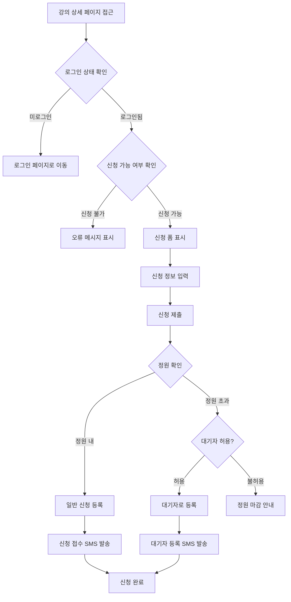
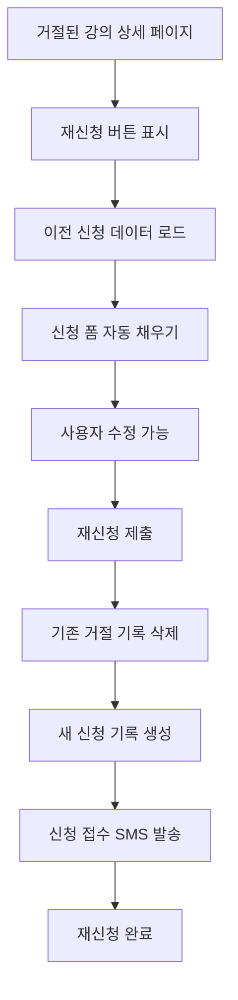

# 강의 신청 관리 시스템 가이드

**작성일:** 2025-07-23 KST  
**최종 수정일:** 2025-07-23 KST  
**상태:** 실제 구현 완료 (v3.6.0)  
**목적:** 강의 신청 관리 시스템의 완전한 기능 및 사용법 가이드

---

## 📋 목차

1. [시스템 개요](#1-시스템-개요)
2. [핵심 기능](#2-핵심-기능)
3. [사용자 플로우](#3-사용자-플로우)
4. [관리자 기능](#4-관리자-기능)
5. [기술적 구현](#5-기술적-구현)
6. [API 엔드포인트](#6-api-엔드포인트)
7. [데이터베이스 스키마](#7-데이터베이스-스키마)
8. [에러 처리](#8-에러-처리)
9. [성능 최적화](#9-성능-최적화)
10. [보안 고려사항](#10-보안-고려사항)

---

## 1. 시스템 개요

### 🎯 시스템 목적
탑마케팅 플랫폼의 강의 신청 관리 시스템은 사용자가 강의에 신청하고, 관리자가 이를 승인/거절할 수 있는 완전한 워크플로우를 제공합니다.

### ✅ 주요 특징
- **완전한 신청 프로세스**: 신청 → 검토 → 승인/거절 → 알림
- **자동 SMS 알림**: 신청 접수, 승인, 거절 시 즉시 SMS 발송
- **재신청 시스템**: 거절된 신청에 대한 완전한 재신청 지원 (v3.6.0)
- **대기자 관리**: 정원 초과 시 대기자 순번 관리
- **상세 사유 제공**: 거절 시 관리자의 상세 사유 제공

### 🔄 현재 상태 (v3.6.0)
- ✅ 기본 신청 시스템 완료
- ✅ 관리자 승인/거절 시스템 완료
- ✅ SMS 알림 시스템 완료
- ✅ 거절 상태 재신청 완전 해결 (2025-07-22)
- ✅ 상세 거절 사유 표시 시스템 완료
- ✅ 대기자 관리 시스템 완료

---

## 2. 핵심 기능

### 📝 신청 관리 기능

#### 2.1 신청 등록
```php
// RegistrationController::createRegistration()
- 강의 정보 유효성 검증
- 신청 기간 확인
- 정원 및 대기자 처리
- 자동 승인 시스템 지원
- SMS 알림 발송
```

#### 2.2 신청 상태 관리
```php
// 지원되는 상태
const STATUSES = [
    'pending',    // 승인 대기
    'approved',   // 승인됨
    'rejected',   // 거절됨
    'cancelled',  // 취소됨
    'waiting'     // 대기자
];
```

#### 2.3 재신청 시스템 (v3.6.0)
```php
// 재신청 가능 조건
- 'cancelled' 상태: 재신청 가능
- 'rejected' 상태: 재신청 가능 ✅
- 기존 신청 기록 자동 삭제 후 새 신청 생성
```

### 📊 관리자 기능

#### 2.4 신청 검토 시스템
- 신청자 정보 상세 확인
- 승인/거절 처리
- 거절 사유 입력
- 처리 시 자동 SMS 알림

#### 2.5 대시보드 관리
- 실시간 신청 현황
- 강의별 신청 통계
- 긴급 처리 알림
- 신청자 관리

---

## 3. 사용자 플로우

### 🔄 일반 신청 플로우


### 🔄 재신청 플로우 (v3.6.0)


---

## 4. 관리자 기능

### 👨‍💼 관리자 대시보드

#### 4.1 신청 현황 모니터링
```php
// AdminController::dashboard()
$stats = [
    'total_pending'    => 대기 중인 신청 수,
    'total_approved'   => 승인된 신청 수,
    'total_rejected'   => 거절된 신청 수,
    'urgent_approvals' => 긴급 처리 필요 신청
];
```

#### 4.2 신청 승인/거절 처리
```php
// 승인 처리
POST /admin/registrations/{id}/approve
{
    "admin_notes": "승인 사유"
}

// 거절 처리  
POST /admin/registrations/{id}/reject
{
    "admin_notes": "거절 사유",
    "detailed_reason": "상세 거절 사유"
}
```

#### 4.3 대기자 관리
- 대기자 순번 자동 관리
- 취소 발생 시 대기자 자동 승격
- 대기자 알림 시스템

---

## 5. 기술적 구현

### 🏗️ 주요 컨트롤러

#### 5.1 RegistrationController
```php
class RegistrationController extends BaseController {
    
    // 신청 상태 조회
    public function getRegistrationStatus($lectureId)
    
    // 신청 등록
    public function createRegistration($lectureId)
    
    // 신청 취소
    public function cancelRegistration($lectureId)
    
    // 이전 신청 데이터 조회 (재신청용)
    public function getPreviousRegistration($lectureId)
}
```

#### 5.2 RegistrationDashboardController
```php
class RegistrationDashboardController extends BaseController {
    
    // 관리자 대시보드
    public function dashboard()
    
    // 신청 승인
    public function approve($registrationId)
    
    // 신청 거절
    public function reject($registrationId)
}
```

#### 5.3 RegistrationNotificationController
```php
class RegistrationNotificationController extends BaseController {
    
    // SMS 알림 발송
    public function sendNotification($type, $registrationId)
    
    // 알림 이력 관리
    public function getNotificationHistory($registrationId)
}
```

### 🗄️ 데이터베이스 스키마

#### 5.4 lecture_registrations 테이블
```sql
CREATE TABLE lecture_registrations (
    id INT AUTO_INCREMENT PRIMARY KEY,
    lecture_id INT NOT NULL,
    user_id INT NOT NULL,
    participant_name VARCHAR(100) NOT NULL,
    participant_email VARCHAR(100) NOT NULL,
    participant_phone VARCHAR(20) NOT NULL,
    company_name VARCHAR(255) NULL,
    position VARCHAR(100) NULL,
    motivation TEXT NULL,
    special_requests TEXT NULL,
    how_did_you_know ENUM('website','social_media','friend_referral','company_notice','email','search_engine','advertisement','other') NULL,
    status ENUM('pending','approved','rejected','cancelled','waiting') DEFAULT 'pending',
    is_waiting_list BOOLEAN DEFAULT FALSE,
    waiting_order INT NULL,
    admin_notes TEXT NULL,
    processed_by INT NULL,
    processed_at TIMESTAMP NULL,
    registration_date TIMESTAMP DEFAULT CURRENT_TIMESTAMP,
    created_at TIMESTAMP DEFAULT CURRENT_TIMESTAMP,
    updated_at TIMESTAMP DEFAULT CURRENT_TIMESTAMP ON UPDATE CURRENT_TIMESTAMP,
    
    FOREIGN KEY (lecture_id) REFERENCES lectures(id) ON DELETE CASCADE,
    FOREIGN KEY (user_id) REFERENCES users(id) ON DELETE CASCADE,
    FOREIGN KEY (processed_by) REFERENCES users(id) ON DELETE SET NULL,
    
    INDEX idx_lecture_registrations_lecture (lecture_id),
    INDEX idx_lecture_registrations_user (user_id),
    INDEX idx_lecture_registrations_status (status),
    INDEX idx_lecture_registrations_waiting (is_waiting_list, waiting_order)
) ENGINE=InnoDB DEFAULT CHARSET=utf8mb4 COLLATE=utf8mb4_unicode_ci;
```

---

## 6. API 엔드포인트

### 📡 사용자 API

#### 6.1 신청 관련 API
```http
# 신청 상태 조회
GET /api/lectures/{lectureId}/registration-status
Response: {
    "lecture_info": {...},
    "registration": {...},
    "user_id": 123
}

# 신청 등록
POST /api/lectures/{lectureId}/registrations
Body: {
    "participant_name": "홍길동",
    "participant_email": "hong@example.com",
    "participant_phone": "010-1234-5678",
    "company_name": "회사명",
    "position": "직책",
    "motivation": "참가 동기",
    "special_requests": "특별 요청사항",
    "how_did_you_know": "website",
    "csrf_token": "토큰값"
}

# 신청 취소
DELETE /api/lectures/{lectureId}/registrations
Body: {
    "csrf_token": "토큰값"
}

# 이전 신청 데이터 조회 (재신청용)
GET /api/lectures/{lectureId}/previous-registration
Response: {
    "participant_name": "홍길동",
    "participant_email": "hong@example.com",
    ...
}
```

### 🔧 관리자 API

#### 6.2 관리 API
```http
# 신청 목록 조회
GET /admin/registrations?lecture_id={id}&status={status}

# 신청 승인
POST /admin/registrations/{id}/approve
Body: {
    "admin_notes": "승인 사유"
}

# 신청 거절
POST /admin/registrations/{id}/reject  
Body: {
    "admin_notes": "거절 사유",
    "detailed_reason": "상세 사유"
}
```

---

## 7. 데이터베이스 스키마

### 🗃️ 관련 테이블

#### 7.1 lectures 테이블 (강의 정보)
```sql
-- 신청 관리 관련 필드
max_participants INT NULL,              -- 최대 참가자 수
current_participants INT DEFAULT 0,     -- 현재 참가자 수  
auto_approval BOOLEAN DEFAULT FALSE,    -- 자동 승인 여부
registration_start_date DATETIME NULL,  -- 신청 시작일
registration_end_date DATETIME NULL,    -- 신청 마감일
allow_waiting_list BOOLEAN DEFAULT FALSE -- 대기자 허용 여부
```

#### 7.2 users 테이블 (사용자 정보)
```sql
-- 신청자 기본 정보 연동
id, nickname, email, phone, created_at
```

#### 7.3 lecture_registrations 테이블 (신청 정보)
위 5.4 섹션 참조

---

## 8. 에러 처리

### ⚠️ 일반적인 에러 상황

#### 8.1 신청 관련 에러
```php
// 로그인 필요
return ResponseHelper::json(null, 401, '로그인이 필요합니다.');

// 강의 없음
return ResponseHelper::json(null, 404, '강의를 찾을 수 없습니다.');

// 중복 신청
return ResponseHelper::json(null, 400, '이미 신청하셨습니다.');

// 신청 기간 아님
return ResponseHelper::json(null, 400, '아직 신청 기간이 아닙니다.');

// 정원 마감
return ResponseHelper::json(null, 400, '정원이 마감되었습니다.');

// 강의 시작됨
return ResponseHelper::json(null, 400, '강의가 이미 시작되었습니다.');
```

#### 8.2 재신청 관련 에러 처리 (v3.6.0)
```php
// 재신청 가능 상태 확인
if ($existing && in_array($existing['status'], ['cancelled', 'rejected'])) {
    // 기존 신청 삭제 후 재신청 허용
    $this->deleteExistingRegistration($existing['id']);
    error_log("재신청을 위해 기존 신청 삭제 완료");
}

// 500 에러 방지를 위한 트랜잭션 처리
try {
    $this->db->beginTransaction();
    // 신청 처리
    $this->db->commit();
} catch (Exception $e) {
    $this->db->rollback();
    error_log("신청 처리 오류: " . $e->getMessage());
    throw $e;
}
```

---

## 9. 성능 최적화

### ⚡ 쿼리 최적화

#### 9.1 인덱스 전략
```sql
-- 강의별 신청 조회 최적화
INDEX idx_lecture_registrations_lecture (lecture_id)

-- 사용자별 신청 이력 조회 최적화  
INDEX idx_lecture_registrations_user (user_id)

-- 상태별 필터링 최적화
INDEX idx_lecture_registrations_status (status)

-- 대기자 순번 관리 최적화
INDEX idx_lecture_registrations_waiting (is_waiting_list, waiting_order)
```

#### 9.2 캐싱 전략
```php
// 강의 정보 캐싱 (5분)
$lecture = CacheHelper::remember(
    "lecture_detail_{$lectureId}", 
    300, 
    function() use ($lectureId) {
        return $this->getLectureInfo($lectureId);
    }
);

// 신청 통계 캐싱 (1분)
$stats = CacheHelper::remember(
    "registration_stats_{$lectureId}",
    60,
    function() use ($lectureId) {
        return $this->getRegistrationStats($lectureId);
    }
);
```

---

## 10. 보안 고려사항

### 🔒 보안 조치

#### 10.1 입력 검증
```php
// 필수 필드 검증
private function validateRegistrationData($input, $user) {
    $errors = [];
    
    // 이름 검증
    if (empty($input['participant_name']) || strlen($input['participant_name']) < 2) {
        $errors['participant_name'] = '이름을 올바르게 입력해주세요.';
    }
    
    // 이메일 검증
    if (!filter_var($input['participant_email'], FILTER_VALIDATE_EMAIL)) {
        $errors['participant_email'] = '올바른 이메일 형식을 입력해주세요.';
    }
    
    // 전화번호 검증
    if (!$this->isValidPhone($input['participant_phone'])) {
        $errors['participant_phone'] = '올바른 연락처 형식을 입력해주세요.';
    }
    
    return $errors;
}
```

#### 10.2 CSRF 보호
```php
// CSRF 토큰 검증
private function validateCsrfToken($token) {
    if (!isset($_SESSION['csrf_token'])) {
        return false;
    }
    return hash_equals($_SESSION['csrf_token'], $token);
}
```

#### 10.3 권한 확인
```php
// 로그인 상태 확인
if (!AuthMiddleware::isLoggedIn()) {
    return ResponseHelper::json(null, 401, '로그인이 필요합니다.');
}

// 본인 강의 신청 방지
if ($lecture['organizer_id'] == $userId) {
    return ResponseHelper::json(null, 400, '본인이 등록한 강의에는 신청할 수 없습니다.');
}
```

---

## 📈 향후 개선 계획

### 단기 계획
1. **알림 시스템 확장**: 이메일 알림 추가
2. **신청서 템플릿**: 강의별 맞춤 신청서 양식
3. **결제 연동**: 유료 강의 결제 시스템

### 장기 계획
1. **모바일 앱 연동**: 푸시 알림 시스템
2. **AI 추천**: 사용자별 강의 추천
3. **다국어 지원**: 영어, 중국어 지원

---

**📝 참고문서**:
- [강의 관리 시스템 가이드](강의_관리_시스템_가이드.md)
- [SMS 알림 시스템 가이드](SMS_알림_시스템_가이드.md)
- [관리자 시스템 가이드](관리자_시스템_가이드.md)

**🔄 최종 업데이트**: 2025-07-23 KST (v3.6.0 재신청 시스템 완전 구현)